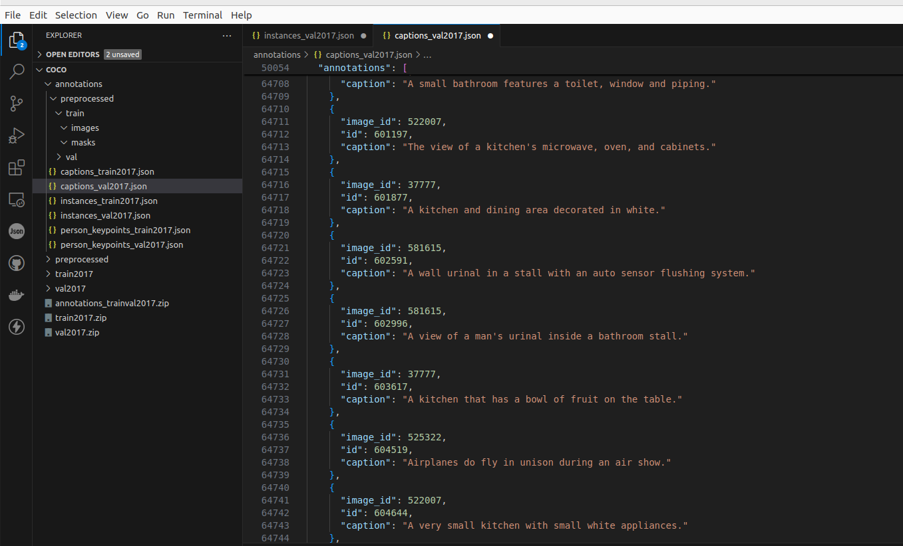
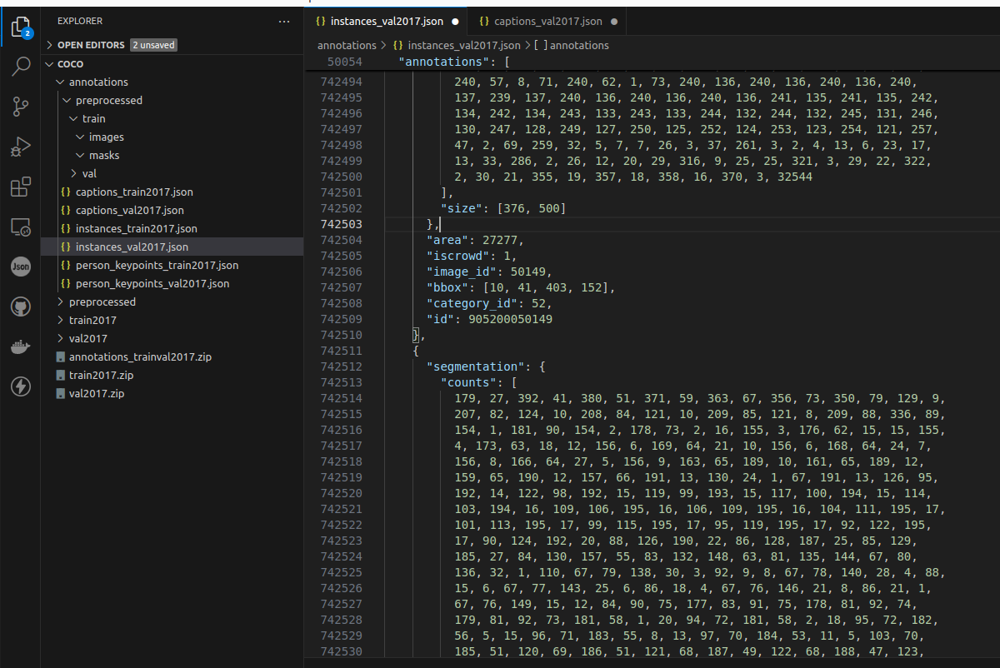
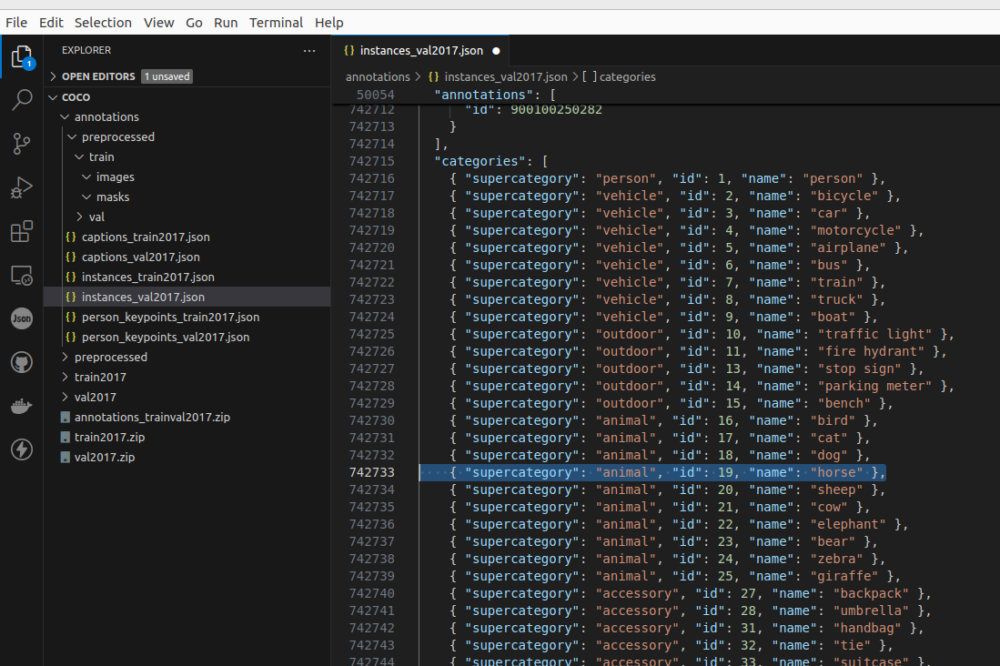

# basic-coco-object-detection

Run a basic network to perform object detection on COCO dataset. Will be used for benchmarking of private projects.

Code and structure are taken from this webpage ([link](https://armanasq.github.io/computer-vision/image-segementation-coco/)), except for the python environment, which is built with poetry.

All commands are intended to be run from root project folder unless explicitly stated.

## Install dependencies

Assuming python3, poetry are installed in the machine, run the following to install dependencies:

```
poetry install
```

## Dataset description

COCO dataset is downloaded from its official page: `https://cocodataset.org/#download`. It is not added to the repo as it is around 20GB but it can be downloaded freely from the website.

Dataset location in the scripts of project is in `/home/maver02/Development/Datasets/COCO/`, which contains the following folders:

```
.
├── annotations
    ├── captions_train2017.json
    ├── captions_val2017.json
    ├── instances_train2017.json
    ├── instances_val2017.json
    ├── person_keypoints_train2017.json
    ├── person_keypoints_val2017.json
├── train2017
├── val2017
```

### Images

The train and val folders contain the images, in jpg format. Here are some examples:


The annotation folder contains the captions, instances and keypoints of each image.

### Captions

The captions files are descriptions of each scene, by image id.



### Instances

The instances files contains, for each image, the bounding box, the segmentation mask associated, and the category id. At the bottom of the file, each category id is associated to its category name.

<div style="display: flex; align-items: center;">
    
    
</div>

### Person keypoints

The person keypoints files contains, for each image

## Data preparation

For data preparation, `pycocotools` library is used. Run the following script to pre-process the data:

```
poetry run python data_preparation/preprocess_coco.py
```

It will create an additional folder called `preprocessed` in the dataset location, containing the following structure:

```
.
├── train
│   ├── images
│   └── masks
└── val
    ├── images
    └── masks
```
